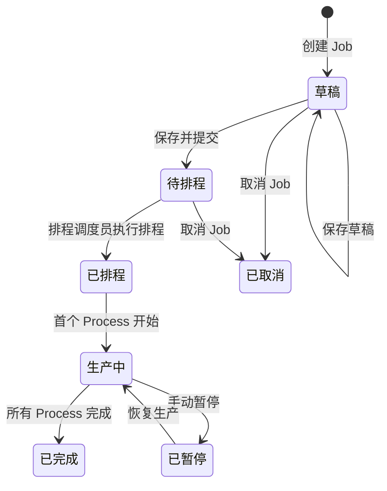

# Job 拆分排产配置模块 — 产品需求文档（PRD）

> **文档编号**：PRD-JOB-001  
> **版本**：v1.0  
> **日期**：2026-05-06  
> **状态**：待评审  
> **编写人**：Kimi Code（ERP 产品经理助手）

---

## 1. 项目背景

### 1.1 业务现状

当前 ERP 系统已建立 **Product（产品/物料）**、**Inventory（库存）**、**Purchase（采购）** 等核心模块的基础能力。在 **Production（生产）** 模块中，已定义了以下核心概念：

- **Part**：公司内部所有资产的管理单元（原料、半成品、成品、工具、易耗品）
- **BOM（Production BOM）**：生产层级的产品树，支持多层嵌套，用于管理生产组装关系
- **Recipe**：绑定到 BOM 节点的生产方案，包含执行 **Team（团队）** 和 **Tasks（任务指示）**
- **Job**：生产任务，需选择 BOM 和 Recipe，分配给团队

但现有 **Job 配置流程尚未产品化**——用户缺乏一个系统化的页面来完成从"选择 Part Number → 展开 BOM → 逐层配置 Recipe → 生成 Process → 参与排程"的完整闭环。

### 1.2 痛点分析

| 痛点 | 现状 | 影响 |
|------|------|------|
| BOM 层级深、节点多 | 手工逐层拆解，容易遗漏子节点 | 生产缺料、停工待料 |
| Recipe 与 Team 绑定不直观 | 无法快速判断哪些节点可合并成 Process | 排程效率低，资源调度混乱 |
| Process 依赖关系复杂 | 缺乏可视化总览预览 | 排程冲突、生产顺序错误 |
| 重复生产 Recipe 选择繁琐 | 每次重新手动选择 | 计划员工作量大，易选错 |

### 1.3 目标用户

| 用户角色 | 职责 | 使用场景 |
|----------|------|----------|
| **生产计划员** | 创建和管理 Job，确保生产任务按时完成 | 每日创建新 Job，配置 BOM 和 Recipe |
| **工艺工程师** | 维护 Recipe 和 Team 的绑定关系 | 审核 Recipe 配置，处理无可用 Recipe 的节点 |
| **排程调度员** | 查看总 Recipe 预览，执行排程 | 确认 Process Group 和依赖关系，启动排程 |

---

## 2. 业务目标

### 2.1 核心目标

1. **一键选择 BOM，自动全路径展开**——减少人工拆解错误
2. **逐节点 Recipe 智能推荐 + 手动修改**——降低重复配置工作量
3. **按 Team 自动 Group 成 Process**——为排程提供最小调度单元
4. **树形总 Recipe 预览**——直观展示 Process 归属和依赖关系
5. **左侧基础信息折叠**——最大化右侧配置区域，提升操作效率

### 2.2 成功指标

| 指标 | 基准值 | 目标值 | 测量方式 |
|------|--------|--------|----------|
| Job 配置平均耗时 | 15 分钟 | ≤ 5 分钟 | 埋点统计从选 Part 到保存的时长 |
| Recipe 配置遗漏率 | 10% | ≤ 1% | 统计保存时未配置 Recipe 的节点比例 |
| 排程冲突率 | 8% | ≤ 2% | 统计排程后需人工调整的 Process 比例 |
| 用户满意度 | — | ≥ 4.0/5 | 生产计划员季度调研 |

---

## 3. 用户角色与权限

### 3.1 角色权限矩阵

| 功能 | 生产计划员 | 工艺工程师 | 排程调度员 | 系统管理员 |
|------|:----------:|:----------:|:----------:|:----------:|
| 创建 Job | ✅ | ✅ | ❌ | ✅ |
| 编辑 Job（未排程） | ✅ | ✅ | ❌ | ✅ |
| 编辑 Job（已排程） | ❌ | ❌ | ❌ | ✅ |
| 配置 Recipe | ✅ | ✅ | ❌ | ✅ |
| 查看总 Recipe 预览 | ✅ | ✅ | ✅ | ✅ |
| 执行排程 | ❌ | ❌ | ✅ | ✅ |
| 维护 Recipe 库 | ❌ | ✅ | ❌ | ✅ |

### 3.2 数据权限

- 生产计划员只能查看和操作自己创建的 Job
- 工艺工程师可查看所有 Job，但只能修改 Recipe 配置相关部分
- 排程调度员可查看所有已配置完成的 Job，但不可修改

---

## 4. 用户故事

### 4.1 生产计划员

1. **作为**生产计划员，**我想**输入 Part Number 后系统自动列出可用 BOM，**以便**快速选择正确的生产版本。
2. **作为**生产计划员，**我想**选择 BOM 后系统自动全路径展开所有子节点，**以便**不遗漏任何生产环节。
3. **作为**生产计划员，**我想**系统根据每个 BOM 节点智能推荐默认 Recipe，**以便**减少重复选择的工作量。
4. **作为**生产计划员，**我想**看到每个 Recipe 对应的 Team 和 Tasks，**以便**确认生产资源的分配是否正确。
5. **作为**生产计划员，**我想**修改系统推荐的 Recipe，**以便**应对特殊生产需求。
6. **作为**生产计划员，**我想**在配置完成后看到总 Recipe 预览，**以便**核对所有节点的配置是否正确。
7. **作为**生产计划员，**我想**在总 Recipe 预览中看到每个节点所属的 Process Group，**以便**理解排程后的调度单元。
8. **作为**生产计划员，**我想**折叠左侧基础信息区域，**以便**最大化右侧配置区域的空间。
9. **作为**生产计划员，**我想**设置 Job 的优先级，**以便**排程时紧急任务优先处理。
10. **作为**生产计划员，**我想**输入总生产数量并分配 MTS/MTO，**以便**区分库存生产和订单生产。⭐ **TBD：MTS/MTO 分配的业务逻辑待确认**
11. **作为**生产计划员，**我想**在 BOM 节点无可用 Recipe 时收到明确提示，**以便**及时联系工艺工程师补充。
12. **作为**生产计划员，**我想**保存未配置完成的 Job 草稿，**以便**分多次完成配置。

### 4.2 工艺工程师

13. **作为**工艺工程师，**我想**查看所有 Job 中各节点使用的 Recipe 分布，**以便**优化 Recipe 库的管理。
14. **作为**工艺工程师，**我想**收到无可用 Recipe 节点的通知，**以便**及时补充 Recipe 避免阻塞生产。
15. **作为**工艺工程师，**我想**查看 Recipe 的历史使用频率统计，**以便**优化默认推荐算法。

### 4.3 排程调度员

16. **作为**排程调度员，**我想**在总 Recipe 预览中看到 Process 之间的依赖关系，**以便**理解生产顺序。
17. **作为**排程调度员，**我想**确认 Job 配置完成后一键进入排程，**以便**快速启动生产计划。
18. **作为**排程调度员，**我想**看到每个 Process 预计需要的资源和时长，**以便**评估排程可行性。

---

## 5. 功能详情

### 5.1 功能架构图

```
┌─────────────────────────────────────────────────────────────────────┐
│                        Job 拆分排产配置页面                          │
├──────────────────────────┬──────────────────────────────────────────┤
│                          │                                          │
│   ┌──────────────────┐   │   ┌──────────────────────────────────┐   │
│   │  Job 基础信息     │   │   │      BOM / Recipe 配置区域        │   │
│   │  ─────────────   │   │   │  ┌────────────────────────────┐  │   │
│   │  • Part Number   │   │   │  │  Step 1: BOM 选择           │  │   │
│   │  • BOM 选择      │   │   │  │  (选 Part 后自动列出)        │  │   │
│   │  • 生产数量      │   │   │  └────────────────────────────┘  │   │
│   │  • MTS/MTO 分配 ⭐│   │   │  ┌────────────────────────────┐  │   │
│   │  • Job 优先级    │   │   │  │  Step 2: 逐层配置 Recipe    │  │   │
│   │  • 计划日期      │   │   │  │  (树形列表，从根到子)        │  │   │
│   │                  │   │   │  │  • 展开每层节点              │  │   │
│   │  [折叠按钮] ←────┼───┼───┼─→│  • 系统推荐默认 Recipe       │  │   │
│   │                  │   │   │  │  • 用户可修改                │  │   │
│   └──────────────────┘   │   │  │  • 展示 Team + Tasks         │  │   │
│                          │   │  └────────────────────────────┘  │   │
│   (可折叠/展开)          │   │  ┌────────────────────────────┐  │   │
│                          │   │  │  Step 3: 总 Recipe 预览     │  │   │
│                          │   │  │  (树形视图，标注 Process)    │  │   │
│                          │   │  │  • 节点 Recipe 信息          │  │   │
│                          │   │  │  • 所属 Process Group        │  │   │
│                          │   │  │  • Process 依赖关系          │  │   │
│                          │   │  │  [视图切换: 列表 ↔ 树形] ⭐  │  │   │
│                          │   │  └────────────────────────────┘  │   │
│                          │   │                                  │   │
├──────────────────────────┴──────────────────────────────────────────┤
│  [保存草稿]  [保存并提交]  [取消]                                    │
└─────────────────────────────────────────────────────────────────────┘
```

### 5.2 功能 F-JOB-001：Job 基础信息配置

#### 5.2.1 页面布局

- **左侧区域**：固定宽度 320px（可折叠至 40px），包含 Job 基础信息表单
- **折叠交互**：点击折叠按钮，左侧收缩为图标栏，右侧配置区域全屏展开；再次点击恢复

#### 5.2.2 字段说明

| 字段名 | 类型 | 必填 | 默认值 | 说明 |
|--------|------|:----:|--------|------|
| Job 编号 | string | 是 | 系统自动生成 | 格式：JOB-YYYYMMDD-XXXX |
| Part Number | 搜索选择 | 是 | — | 从 Part 库搜索选择，支持编码/名称模糊搜索 |
| BOM 版本 | 下拉选择 | 是 | — | 选择 Part Number 后自动列出该 Part 的所有可用 BOM |
| 生产数量 | decimal | 是 | 1 | 正整数，单位跟随 Part 的默认生产单位 |
| MTS 数量 | decimal | 否 | 0 | Make to Stock 数量，≤ 生产数量 ⭐ **TBD** |
| MTO 数量 | decimal | 否 | 0 | Make to Order 数量，≤ 生产数量，MTS + MTO = 生产数量 ⭐ **TBD** |
| Job 优先级 | 单选 | 是 | 中 | 选项：紧急 / 高 / 中 / 低 |
| 计划开始日期 | date | 否 | 今天 | 排程参考日期 |
| 计划完成日期 | date | 否 | — | 根据 BOM 层级和 Recipe 预估（可手动调整） |
| 备注 | text | 否 | — | 自由文本，最多 500 字 |

#### 5.2.3 交互规则

1. **Part Number 选择后**：
   - 自动调用 API 查询该 Part 的所有可用 BOM 列表
   - BOM 下拉框填充，默认选中最新版本
   - 若该 Part 无可用 BOM，显示红色提示："该物料未配置 BOM，请联系工艺工程师"

2. **BOM 选择后**：
   - 触发全路径展开，右侧配置区域进入 Step 2
   - 系统递归展开 BOM 树，直至叶子节点（无子 BOM 的节点）
   - 展开过程中进行循环依赖检测，若发现循环引用则阻断并提示

3. **生产数量变更后**：
   - 自动重新计算所有节点的需求数量（考虑 BOM 中的单位换算）
   - 若已有 Recipe 配置，提示用户"数量已变更，是否重新计算？"

### 5.3 功能 F-JOB-002：BOM 全路径自动展开

#### 5.3.1 展开规则

1. **递归展开**：从选中的 BOM 根节点开始，逐层递归展开所有子节点
2. **循环检测**：展开前检测 BOM 树是否存在循环依赖（A → B → C → A），存在则阻断并提示
3. **最大层级限制**：默认最大展开 10 层，超过则提示"BOM 层级过深，请检查配置"
4. **展开结果缓存**：同一 BOM 在同一 Job 中只展开一次，避免重复计算

#### 5.3.2 展开后的数据结构

```typescript
interface BOMNode {
  nodeId: string;           // 节点唯一标识
  partNumber: string;       // 物料编码
  partName: string;         // 物料名称
  level: number;            // BOM 层级（根节点=0）
  parentNodeId: string;     // 父节点 ID
  quantity: number;         // 需求数量（根据父节点用量和单位换算计算）
  unit: string;             // 单位
  isLeaf: boolean;          // 是否为叶子节点（无子 BOM）
  children: BOMNode[];      // 子节点列表
  // 配置后填充
  selectedRecipe?: Recipe;  // 选中的 Recipe
  processGroupId?: string;  // 所属 Process Group
}
```

### 5.4 功能 F-JOB-003：逐层 Recipe 配置

#### 5.4.1 交互流程

```
用户点击节点展开 → 系统筛选匹配 Recipe 列表 → 智能推荐默认 Recipe → 
用户确认或修改 → 展示 Recipe 详情（Team + Tasks）→ 标记节点为已配置
```

#### 5.4.2 Recipe 筛选规则

1. **匹配条件**：Recipe 的 `applicablePartNumbers` 包含当前节点的 Part Number
2. **状态过滤**：只展示状态为"启用"的 Recipe
3. **排序规则**：
   - 第一优先级：历史使用频率（该 Recipe 在此 Part 上的使用次数）
   - 第二优先级：创建时间（较新的优先）

#### 5.4.3 智能推荐算法

```
默认推荐 Recipe = max(历史使用频率) 的 Recipe
若频率相同，取最新创建的
若该 Part 无历史使用记录，推荐创建时间最新的 Recipe
```

#### 5.4.4 Recipe 详情展示

选中 Recipe 后，节点下方展开显示：

| 信息项 | 说明 |
|--------|------|
| Recipe 名称 | 工艺方案名称 |
| Team | 执行团队名称 |
| 预计工时 | 该 Recipe 的标准工时 |
| Tasks 列表 | 任务指示清单，可展开查看详情 |
| 设备需求 | 所需设备（如有） |

#### 5.4.5 节点状态标识

| 状态 | 图标 | 颜色 | 说明 |
|------|:----:|:----:|------|
| 未配置 | ○ | 灰色 | 节点展开后未选择 Recipe |
| 已配置（推荐） | ✓ | 绿色 | 使用了系统推荐的 Recipe |
| 已配置（手动） | ✓ | 蓝色 | 用户手动修改了 Recipe |
| 无可用 Recipe | ⚠ | 红色 | 该节点无匹配的 Recipe，需联系工艺工程师 |
| 配置冲突 | ⚠ | 橙色 | 同一 Process Group 内存在不兼容的 Recipe（如设备冲突） |

### 5.5 功能 F-JOB-004：Process 自动 Group

#### 5.5.1 Group 规则

1. **Group 条件**：同一 Team 的**连续**节点（可跨层级）合并为一个 Process
2. **隔断条件**：遇到不同 Team 的节点，当前 Process 结束，新 Process 开始
3. **叶子节点优先**：从叶子节点向上回溯，尽可能合并连续的同 Team 节点

#### 5.5.2 Group 示例

```
BOM 树结构：
成品自行车 (Team: 总装车间)          → Process 3: 总装车间
├── 车架 (Team: 焊接车间)             → Process 1: 焊接车间
│   ├── 钢管 (Team: 切割车间)         → Process 0: 切割车间
│   └── 焊丝 (Team: 焊接车间)         → Process 1: 焊接车间（与父节点合并）
├── 轮胎 (Team: 总装车间)             → Process 3: 总装车间（与根节点合并）
└── 链条 (Team: 总装车间)             → Process 3: 总装车间（与根节点合并）

最终 Process：
- Process 0: 切割车间 — 钢管切割
- Process 1: 焊接车间 — 车架焊接 + 焊丝使用
- Process 3: 总装车间 — 轮胎安装 + 链条安装 + 成品组装
```

#### 5.5.3 Process 数据结构

```typescript
interface Process {
  processId: string;        // Process 唯一标识
  processName: string;      // Process 名称（自动生成：Team 名 + 序号）
  teamId: string;           // 执行团队 ID
  teamName: string;         // 执行团队名称
  jobId: string;            // 所属 Job ID
  nodes: BOMNode[];         // 包含的 BOM 节点（按层级排序）
  predecessorIds: string[]; // 前置 Process ID 列表（依赖关系）
  estimatedHours: number;   // 预计总工时
  status: 'pending' | 'scheduled' | 'in_progress' | 'completed'; 
}
```

#### 5.5.4 依赖关系计算

1. **父子依赖**：若 Process A 包含节点 X，Process B 包含 X 的子节点 Y，则 B 依赖 A（A 完成后 B 才能开始）
2. **跨分支依赖**：不同分支的 Process 之间无依赖，可并行执行
3. **依赖图可视化**：在总 Recipe 预览中以箭头连线展示

### 5.6 功能 F-JOB-005：总 Recipe 预览（树形视图）

#### 5.6.1 视图说明

- **默认视图**：树形视图，保留 BOM 层级结构
- **节点展示内容**：
  - Part Number + Part Name
  - 需求数量 + 单位
  - 选中 Recipe 名称
  - 所属 Process Group（以色块/标签形式展示）
  - Team 名称

#### 5.6.2 Process Group 可视化

- 每个 Process Group 分配一个唯一颜色
- 同一 Process 的节点边框或背景使用相同颜色
- Process 之间用箭头连线表示依赖关系

#### 5.6.3 视图切换（⭐ 后续补充）

- 右上角提供视图切换 Icon
- **列表视图**：按 Process Group 平铺展示，适合排程人员快速浏览
- **树形视图**：保留 BOM 层级，适合工艺人员核对

### 5.7 功能 F-JOB-006：保存与状态流转

#### 5.7.1 保存选项

| 按钮 | 动作 | 校验规则 |
|------|------|----------|
| 保存草稿 | 保存当前配置，不校验完整性 | 无 |
| 保存并提交 | 保存并标记为"待排程" | 所有节点必须已配置 Recipe，无红色错误 |
| 取消 | 放弃当前编辑 | 有未保存变更时提示确认 |

#### 5.7.2 Job 状态流转



---

## 6. 异常流程与边界条件

### 6.1 异常流程

| 异常场景 | 触发条件 | 系统响应 | 用户操作 |
|----------|----------|----------|----------|
| BOM 循环依赖 | BOM 树中存在 A→B→C→A | 阻断展开，红色提示"BOM 存在循环依赖，请检查配置" | 联系工艺工程师修复 BOM |
| 无可用 Recipe | 某 BOM 节点无匹配的 Recipe | 节点标记红色⚠，提示"无可用 Recipe" | 联系工艺工程师补充 Recipe |
| 数量变更 | 用户修改生产数量 | 提示"数量已变更，是否重新计算所有节点需求？" | 确认重新计算或取消 |
| 网络中断 | 配置过程中断网 | 自动保存草稿到本地，恢复网络后提示同步 | 确认同步或放弃 |
| 并发编辑 | 多人同时编辑同一 Job | 后保存者收到冲突提示，提供"覆盖/放弃/对比"选项 | 选择处理方式 |
| 排程后修改 | Job 已排程，用户尝试修改 | 阻断修改，提示"Job 已排程，如需修改请先取消排程" | 联系排程调度员取消排程 |

### 6.2 边界条件

| 边界条件 | 处理规则 |
|----------|----------|
| BOM 层级超过 10 层 | 阻断展开，提示"BOM 层级过深" |
| 节点数量超过 1000 个 | 分页加载，虚拟滚动展示 |
| Recipe 数量为 0 | 标记红色，阻断提交 |
| 生产数量为 0 或负数 | 表单校验阻断，提示"请输入有效数量" |
| MTS + MTO ≠ 生产数量 | 表单校验阻断，或自动调整（待确认）⭐ **TBD** |
| 计划完成日期 < 计划开始日期 | 表单校验阻断 |

---

## 7. 非功能需求

### 7.1 性能需求

| 指标 | 要求 | 说明 |
|------|------|------|
| BOM 展开响应时间 | ≤ 2 秒 | 1000 个节点以内的 BOM |
| Recipe 筛选响应时间 | ≤ 500ms | 节点点击后筛选匹配 Recipe |
| 页面加载时间 | ≤ 3 秒 | 首次进入 Job 配置页面 |
| 总 Recipe 预览渲染 | ≤ 1 秒 | 1000 个节点以内的树形渲染 |

### 7.2 可用性需求

- 支持键盘快捷键（Tab 切换字段、Enter 确认、Esc 取消）
- 支持批量配置（同一层级多个节点选择相同 Recipe）
- 支持配置撤销/重做（Ctrl+Z / Ctrl+Y）
- 支持拖拽调整 Process 顺序（在预览模式下）

### 7.3 兼容性需求

- 支持 Chrome 90+、Edge 90+、Firefox 88+
- 最低分辨率 1366×768，推荐 1920×1080
- 不支持移动端（ERP 生产配置为桌面端专用场景）

### 7.4 安全需求

- 所有 API 调用需携带 JWT Token
- 敏感操作（提交 Job）需二次确认
- 操作日志记录：谁、何时、修改了什么字段

---

## 8. 上线验收标准

### 8.1 功能验收

- [ ] Part Number 选择后正确列出可用 BOM
- [ ] BOM 选择后全路径正确展开，无遗漏节点
- [ ] 循环依赖 BOM 被正确检测并阻断
- [ ] 每个节点正确筛选匹配 Recipe 列表
- [ ] 默认 Recipe 推荐基于历史频率
- [ ] 用户可成功修改 Recipe 并保存
- [ ] Team 相同连续节点正确合并为 Process
- [ ] Process 依赖关系正确计算
- [ ] 总 Recipe 预览正确展示树形结构和 Process 归属
- [ ] 左侧基础信息可折叠/展开
- [ ] Job 状态流转符合设计
- [ ] 所有异常场景有明确提示和处理

### 8.2 性能验收

- [ ] BOM 展开响应时间 ≤ 2 秒（1000 节点）
- [ ] 页面加载时间 ≤ 3 秒
- [ ] 无内存泄漏（长时间使用不卡顿）

### 8.3 用户验收

- [ ] 生产计划员完成 3 个真实 Job 的配置，反馈满意度 ≥ 4/5
- [ ] 工艺工程师确认 Recipe 推荐准确率 ≥ 80%
- [ ] 排程调度员确认 Process Group 和依赖关系正确

---

## 9. 风险与依赖

### 9.1 风险清单

| 风险 | 可能性 | 影响 | 应对措施 |
|------|:------:|:----:|----------|
| BOM 数据质量差（层级混乱、循环依赖多） | 中 | 高 | 上线前进行 BOM 数据清洗，提供批量检测工具 |
| Recipe 库不完善（大量节点无 Recipe） | 高 | 高 | 上线前推动工艺工程师补充 Recipe，提供导入模板 |
| 历史使用频率数据不足（新系统） | 高 | 中 | 冷启动阶段使用创建时间排序，积累 1 个月后启用频率算法 |
| 用户对树形配置界面学习成本高 | 中 | 中 | 提供新手引导（Tour），首次进入时高亮关键操作 |
| 大 BOM（>1000 节点）性能问题 | 低 | 高 | 提前进行性能测试，必要时采用虚拟滚动 + 懒加载 |

### 9.2 外部依赖

| 依赖项 | 状态 | 说明 |
|--------|:----:|------|
| Part 库数据 | ✅ 已有 | 依赖 Product 模块的 Part 数据 |
| BOM 数据 | ✅ 已有 | 依赖 Product 模块的 Production BOM |
| Recipe 库 | ⚠️ 部分 | 已有 Recipe 概念，需补充 `applicablePartNumbers` 字段 |
| Team 数据 | ⚠️ 部分 | 已有 Teams 概念，需确认数据结构 |
| 排程系统 | 🚧 开发中 | Job 配置完成后需对接排程模块 |
| 权限系统 | ✅ 已有 | 依赖用户中心的角色权限能力 |

### 9.3 TBD 待确认项

| 序号 | 问题 | 影响范围 | 建议解决时间 |
|------|------|----------|:------------:|
| 1 | MTS/MTO 数量分配的业务逻辑 | Job 配置字段、排程逻辑、成本核算 | 开发前 |

---

## 10. 附录

### 10.1 术语表

| 术语 | 英文 | 定义 |
|------|------|------|
| Job | Job | 生产任务，包含 Part Number、BOM、Recipe、Process 的完整生产单元 |
| Process | Process | 参与排产的最小单元，由相同 Team 的 BOM 分支自动 Group 而成 |
| BOM | Bill of Materials | 物料清单，描述产品的层级组装关系 |
| Recipe | Recipe | 工艺方案，绑定到 BOM 节点，包含 Team 和 Tasks |
| Team | Team | 执行生产的团队/车间 |
| Tasks | Tasks | 任务指示，Recipe 中的具体操作步骤 |
| MTS | Make to Stock | 按库存生产，成品先入库存 |
| MTO | Make to Order | 按订单生产，成品直接关联销售订单 |

### 10.2 相关文档

- [Product 模块说明](01-产品模块.md)
- [库存管理模块](01-库存管理模块.md)
- [采购管理模块](02-采购管理模块.md)
- [系统架构](系统架构.md)

### 10.3 变更记录

| 日期 | 版本 | 修改人 | 修改内容 |
|------|------|--------|----------|
| 2026-05-06 | v1.0 | Kimi Code | 创建 PRD，完成初稿 |

---

> 📌 **文档状态**：本 PRD 基于 2026-05-06 的 brainstorming 会议产出，已确认需求框架。待 MTS/MTO 业务逻辑确认后更新 v1.1。
