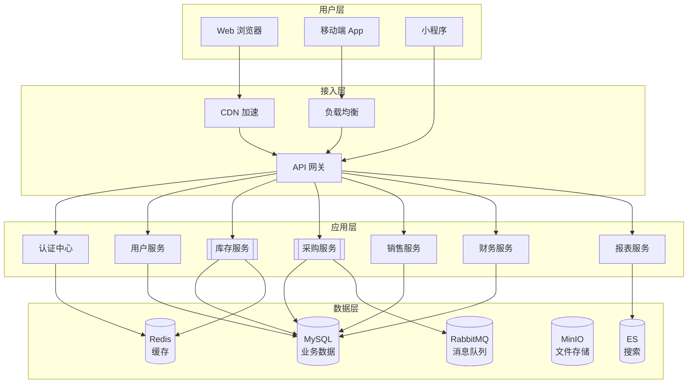
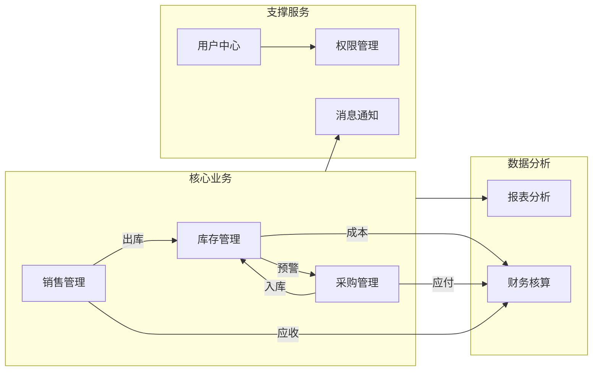
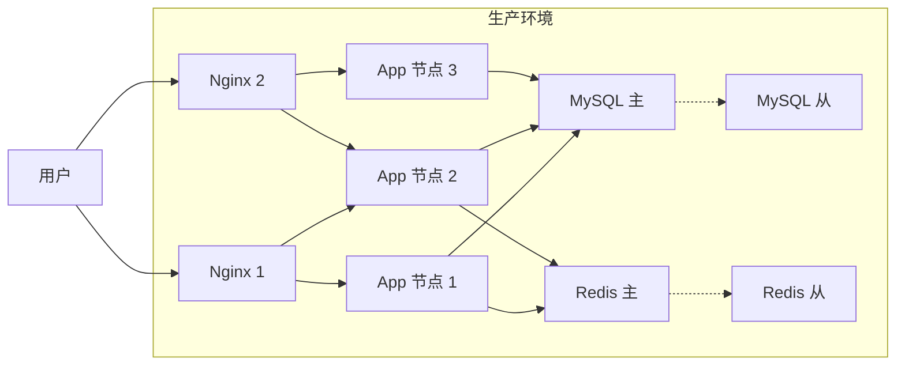

# 系统架构

本文档描述 ERP 系统的整体架构设计。

## 1. 系统全景图

## 2. 模块依赖关系

## 3. 技术栈规划

| 层级 | 技术选型 | 说明 |
|------|----------|------|
| 前端 | Vue 3 / Element Plus | PC 管理端 |
| 移动端 | UniApp | 跨平台 App/小程序 |
| 后端 | Spring Boot | Java 微服务 |
| 数据库 | MySQL 8.0 | 主数据库 |
| 缓存 | Redis | 热点数据、会话缓存 |
| 搜索 | Elasticsearch | 商品搜索、日志检索 |
| 消息队列 | RabbitMQ | 异步解耦、事件驱动 |
| 文件存储 | MinIO | 文档、图片存储 |
| 容器化 | Docker + K8s | 部署运维 |

## 4. 部署架构（规划）

---

> 📌 说明：本架构为规划阶段设计，后续开发中会根据实际情况调整。
