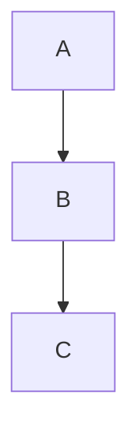

# 使用指南

本目录存放操作手册、开发规范、流程说明等指导性文档。

## 📘 文档列表

| 文档 | 说明 | 状态 |
|------|------|------|
| [GitHub 工作流](GitHub工作流.md) | Issue 管理、分支策略、审核流程、TDD 开发 | ✅ 已发布 |
| [文档编写规范](文档编写规范.md) | Markdown 编写规范、命名约定 | 待创建 |
| [Git 提交规范](Git提交规范.md) | Commit Message 规范、分支策略 | 待创建 |
| [Obsidian 使用技巧](Obsidian使用技巧.md) | 双链、标签、图谱用法 | 待创建 |

## 💡 快速提示

### 如何引用图片

```markdown

```

### 如何引用其他文档（Obsidian 双链）

```markdown
[[文档名称]]
```

### 如何画 Mermaid 图

在 Markdown 中使用代码块，标记为 `mermaid`：

~~~markdown

~~~

支持的图表类型：
- `flowchart` — 流程图
- `sequenceDiagram` — 时序图
- `erDiagram` — 实体关系图
- `stateDiagram-v2` — 状态图
- `classDiagram` — 类图
- `gantt` — 甘特图
