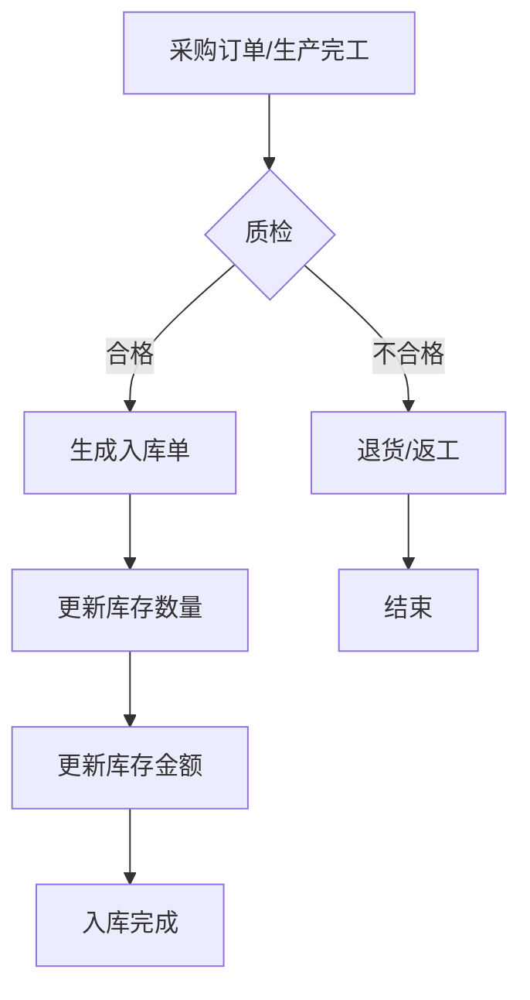
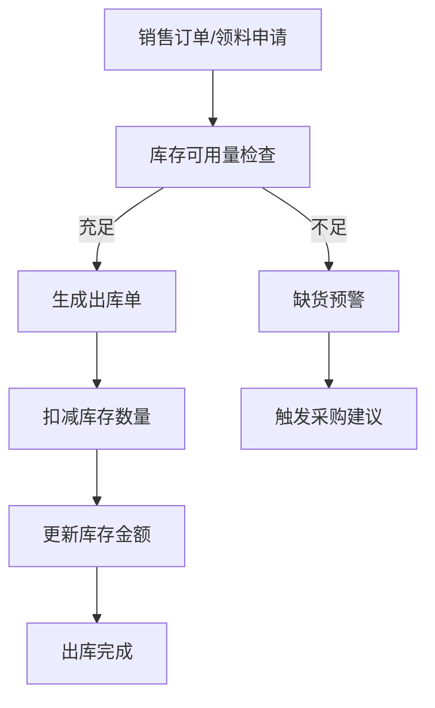
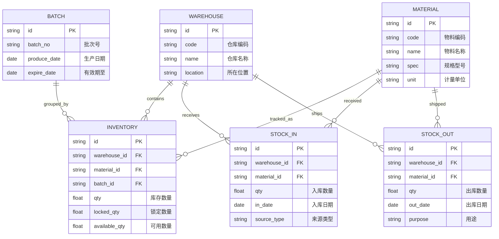
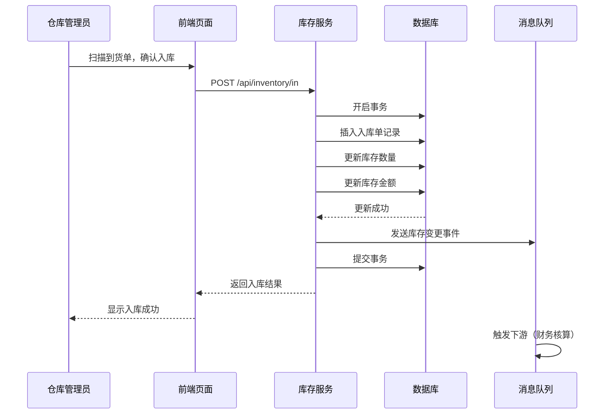

# 01-库存管理模块

> #模块/核心 #状态/编写中

## 1. 模块概述

### 1.1 功能简介
库存管理模块负责对企业物料、商品的入库、出库、盘点、调拨等全过程进行管理，确保账实相符，为采购和销售提供准确的库存数据支撑。

### 1.2 业务价值
- **降低库存成本**：通过安全库存预警，避免过量采购和库存积压
- **提高周转效率**：实时掌握库存状态，加速库存周转
- **减少人工差错**：系统化管理替代手工台账，降低出错率

### 1.3 相关模块
- 上游模块：[[02-采购管理模块]]（采购入库）、销售管理模块（销售出库）
- 下游模块：财务管理模块（库存成本核算）、报表分析模块

---

## 2. 业务流程

### 2.1 入库流程

### 2.2 出库流程

### 2.3 流程说明
1. **入库环节**：采购到货或生产完工后，需先质检，合格品才能入库
2. **出库环节**：根据业务单据自动扣减库存，支持先进先出、加权平均等计价方式
3. **盘点环节**：定期或临时盘点，系统生成盘盈盘亏单自动调整

---

## 3. 功能清单

| 功能编号 | 功能名称 | 功能描述 | 优先级 |
|----------|----------|----------|--------|
| INV-001 | 入库管理 | 采购入库、生产入库、其他入库 | P0 |
| INV-002 | 出库管理 | 销售出库、领料出库、其他出库 | P0 |
| INV-003 | 库存盘点 | 定期盘点、临时盘点、盘盈盘亏处理 | P0 |
| INV-004 | 库存调拨 | 仓库间调拨、组织间调拨 | P1 |
| INV-005 | 库存预警 | 安全库存、超储、短缺预警 | P1 |
| INV-006 | 库存查询 | 实时库存、批次库存、序列号追踪 | P0 |

---

## 4. 数据模型

### 4.1 实体关系图

### 4.2 核心字段说明

| 字段名 | 类型 | 必填 | 说明 |
|--------|------|------|------|
| warehouse_id | string | 是 | 仓库唯一标识 |
| material_id | string | 是 | 物料唯一标识 |
| batch_id | string | 否 | 批次号，用于批次管理 |
| qty | decimal | 是 | 库存数量 |
| locked_qty | decimal | 是 | 已锁定数量（待出库） |
| available_qty | decimal | 是 | 可用数量 = qty - locked_qty |

---

## 5. 接口设计

### 5.1 接口列表

| 接口地址 | 方法 | 说明 |
|----------|------|------|
| /api/inventory/query | GET | 查询库存明细 |
| /api/inventory/in | POST | 入库操作 |
| /api/inventory/out | POST | 出库操作 |
| /api/inventory/transfer | POST | 库存调拨 |
| /api/inventory/adjust | POST | 库存调整（盘点） |

### 5.2 入库接口时序图

---

## 6. 页面原型

> 设计图完成后放入 `assets/images/`，此处引用：
>
> 

---

## 7. 待办事项

- [x] 编写模块概述
- [x] 绘制业务流程图
- [x] 设计数据模型
- [ ] 补充页面原型图
- [ ] 细化接口字段定义

---

## 8. 变更记录

| 日期 | 版本 | 修改人 | 修改内容 |
|------|------|--------|----------|
| 2025-04-27 | v0.1 | Kimi Code | 创建文档，完成初稿 |
