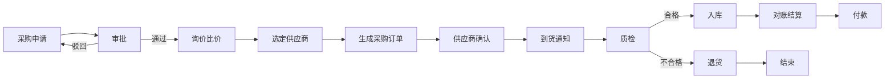
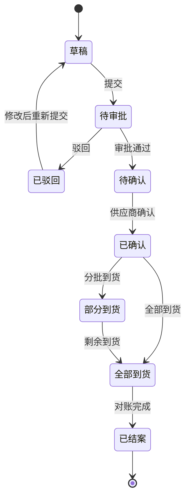
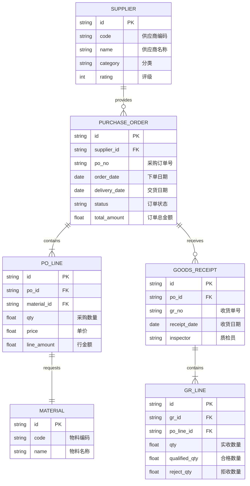
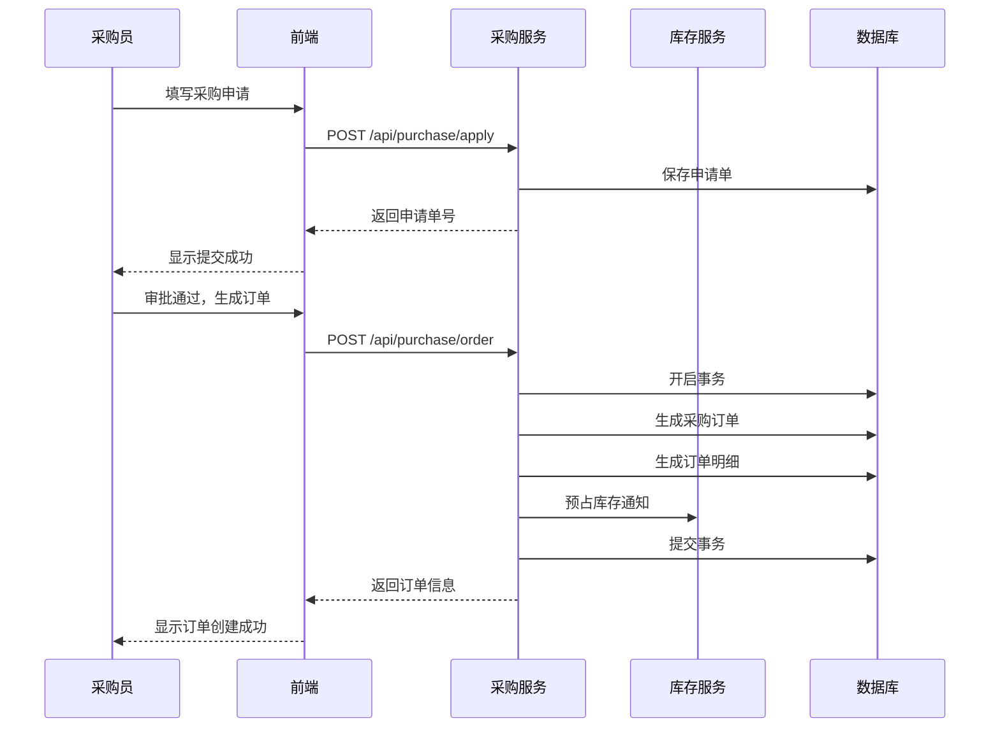

# 02-采购管理模块

> #模块/核心 #状态/编写中

## 1. 模块概述

### 1.1 功能简介
采购管理模块覆盖从采购申请、询价比价、采购订单、到货质检到入库结算的全过程，帮助企业优化采购流程、控制采购成本。

### 1.2 业务价值
- **成本控制**：通过供应商比价、历史价格分析，降低采购成本
- **效率提升**：电子化审批流程，缩短采购周期
- **合规管理**：全流程留痕，满足审计要求

### 1.3 相关模块
- 上游模块：库存管理模块（库存预警触发采购）、需求计划模块
- 下游模块：[[01-库存管理模块]]（采购入库）、财务管理模块（应付账款）

---

## 2. 业务流程

### 2.1 采购全流程

### 2.2 采购订单状态流转

### 2.3 流程说明
1. **采购申请**：由库存预警或手动发起，明确物料、数量、需求日期
2. **询价比价**：向多个供应商询价，系统记录报价供比对
3. **订单跟踪**：实时跟踪订单状态，预警到货延期风险
4. **质检入库**：货到后质检合格方可入库，不合格触发退货流程

---

## 3. 功能清单

| 功能编号 | 功能名称 | 功能描述 | 优先级 |
|----------|----------|----------|--------|
| PUR-001 | 采购申请 | 手动/自动创建采购申请单 | P0 |
| PUR-002 | 采购审批 | 多级审批流配置 | P0 |
| PUR-003 | 询价比价 | 供应商报价录入与比对 | P1 |
| PUR-004 | 采购订单 | 订单创建、变更、跟踪 | P0 |
| PUR-005 | 到货管理 | 到货登记、质检对接 | P0 |
| PUR-006 | 供应商管理 | 供应商档案、评级、黑名单 | P1 |
| PUR-007 | 采购分析 | 价格趋势、供应商绩效 | P2 |

---

## 4. 数据模型

### 4.1 实体关系图

---

## 5. 接口设计

### 5.1 采购下单时序图

---

## 6. 页面原型

> 待补充 UI 设计图，存放路径：`assets/images/采购管理-xxx.png`

---

## 7. 待办事项

- [x] 编写模块概述与流程
- [x] 绘制状态流转图
- [ ] 补充供应商管理细节
- [ ] 添加页面原型图

---

## 8. 变更记录

| 日期 | 版本 | 修改人 | 修改内容 |
|------|------|--------|----------|
| 2025-04-27 | v0.1 | Kimi Code | 创建文档 |
