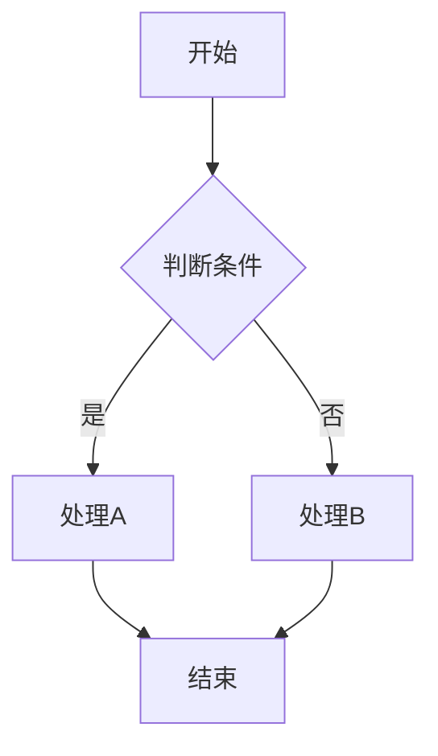
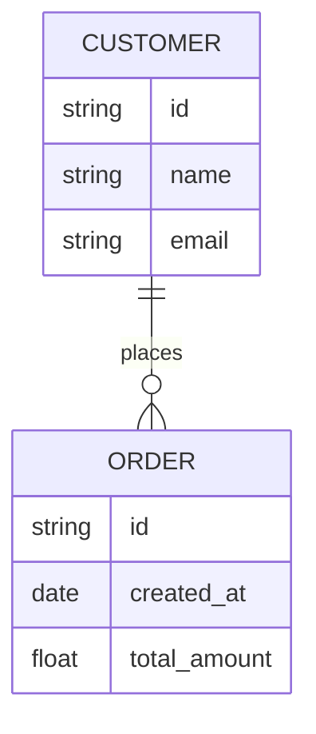
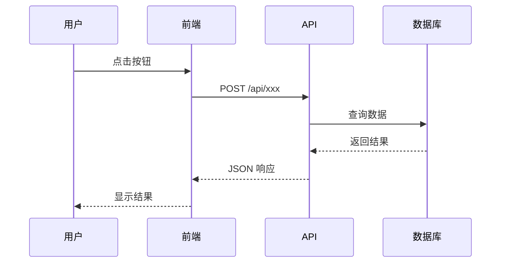

# 【模块名称】

> 模板说明：复制此文件，替换所有 `【】` 中的内容。

## 1. 模块概述

### 1.1 功能简介
【一句话描述这个模块是做什么的】

### 1.2 业务价值
【这个模块解决了什么问题，带来什么价值】

### 1.3 相关模块
- 上游模块：[[模块A]]、[[模块B]]
- 下游模块：[[模块C]]、[[模块D]]

---

## 2. 业务流程

### 2.1 流程图

### 2.2 流程说明
1. **步骤一**：描述...
2. **步骤二**：描述...
3. **步骤三**：描述...

---

## 3. 功能清单

| 功能编号 | 功能名称 | 功能描述 | 优先级 |
|----------|----------|----------|--------|
| F-001 | 【功能1】 | 【描述】 | P0 |
| F-002 | 【功能2】 | 【描述】 | P1 |

---

## 4. 数据模型

### 4.1 实体关系图（ER 图）

### 4.2 核心字段说明

| 字段名 | 类型 | 必填 | 说明 |
|--------|------|------|------|
| id | string | 是 | 唯一标识 |
| name | string | 是 | 名称 |

---

## 5. 接口设计（可选）

### 5.1 接口列表

| 接口地址 | 方法 | 说明 |
|----------|------|------|
| /api/xxx | GET | 查询列表 |
| /api/xxx | POST | 创建数据 |

### 5.2 接口时序图

---

## 6. 页面原型 / UI 说明

> 如有 UI 设计图，放在 `assets/images/` 目录，此处引用：
> 
> 

---

## 7. 待办事项

- [ ] 【待办1】
- [ ] 【待办2】

---

## 8. 变更记录

| 日期 | 版本 | 修改人 | 修改内容 |
|------|------|--------|----------|
| 2025-04-27 | v0.1 | 【姓名】 | 创建文档 |
