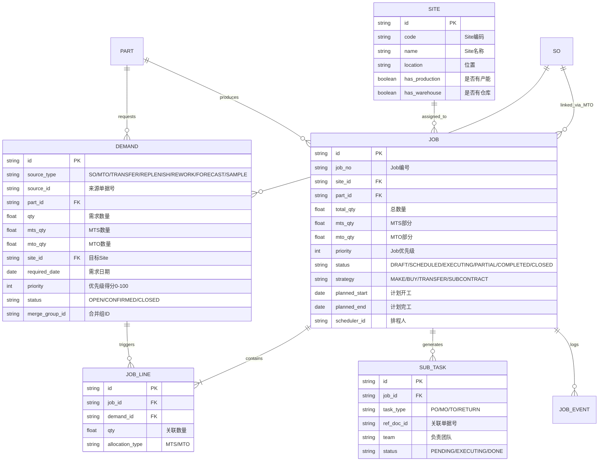
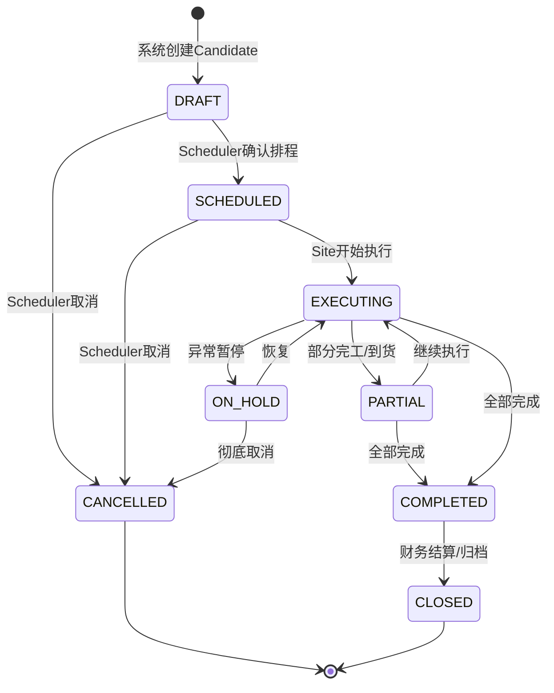
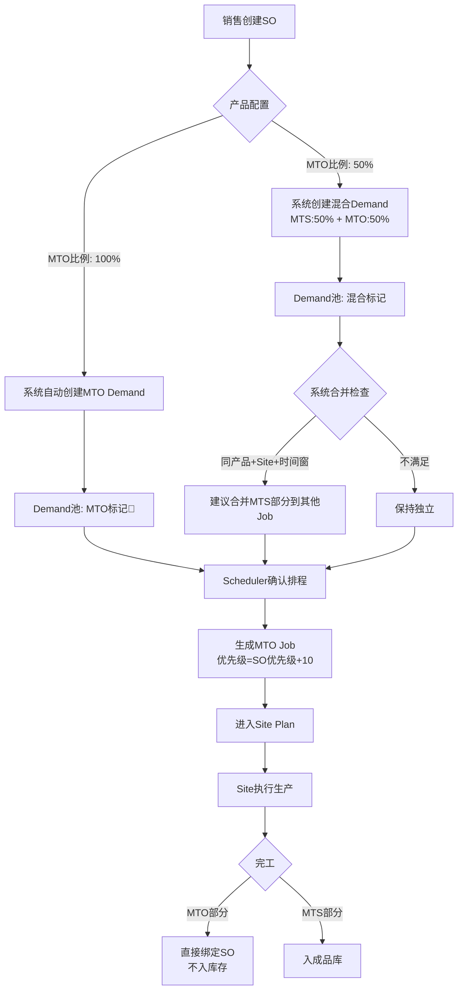
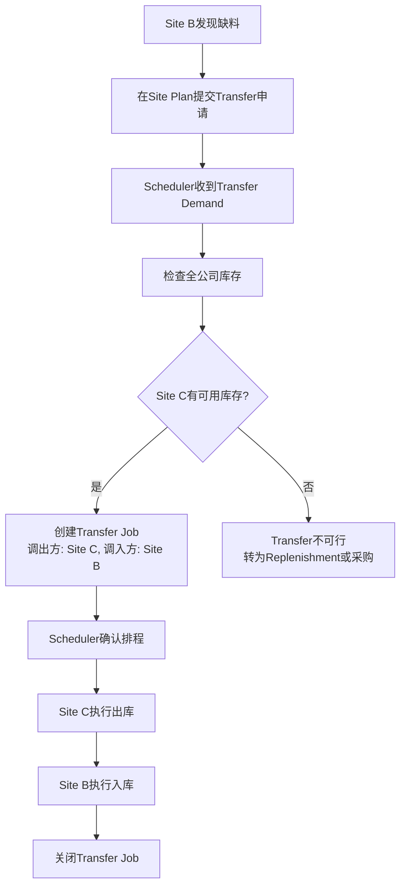
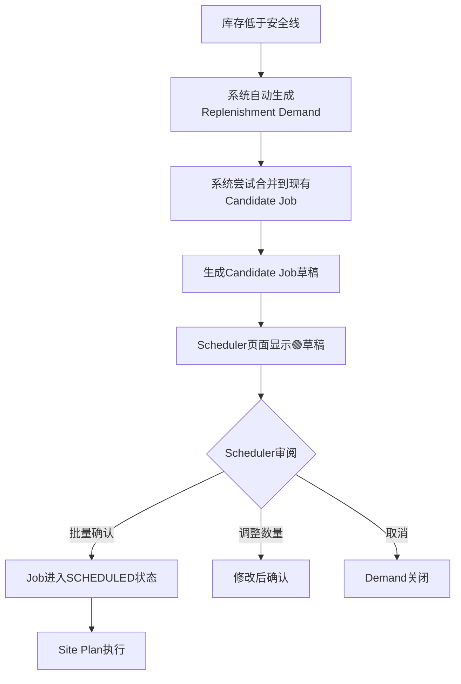
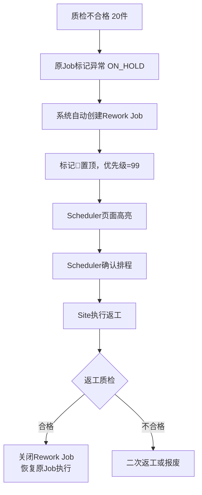
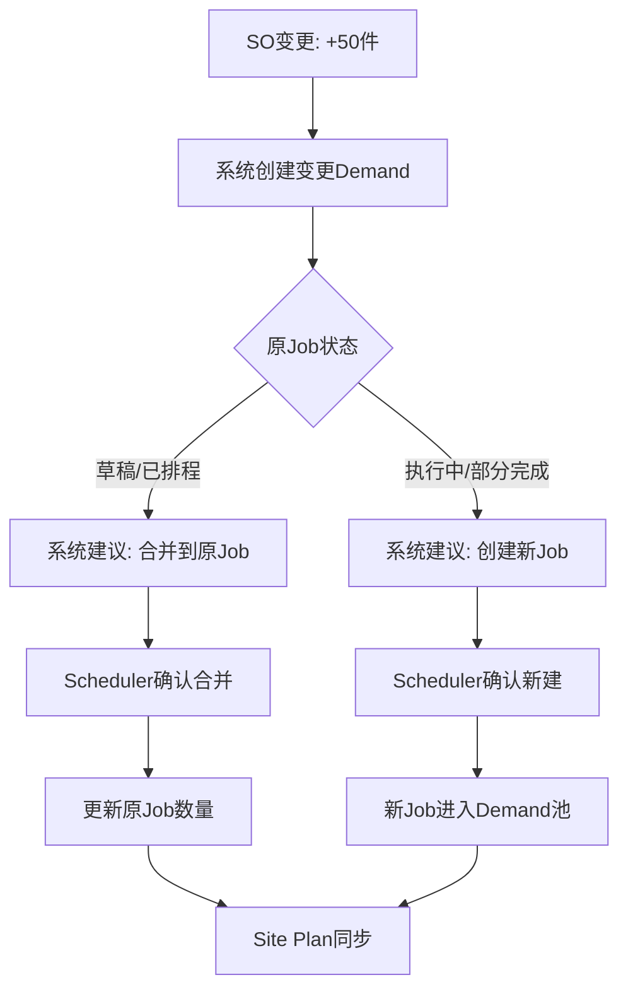

# Scheduler 需求中枢 — 系统设计方案

> 状态：已确认灵活模式（Site Plan可调整顺序并同步Scheduler）
> 默认决策：Transfer不计价 | 排程周期：实时

---

## 一、架构总览

```
┌─────────────────────────────────────────────────────────────────────┐
│                         DEMAND 来源层                                │
│  ┌─────────┐ ┌─────────┐ ┌─────────┐ ┌─────────┐ ┌─────────────┐  │
│  │   SO    │ │   MTO   │ │Transfer │ │Replenish│ │   Rework    │  │
│  │ (销售)  │ │(计划)   │ │(调拨)   │ │(补货)   │ │ (返工)     │  │
│  └────┬────┘ └────┬────┘ └────┬────┘ └────┬────┘ └──────┬──────┘  │
│       └─────────────┴──────────┴───────────┴─────────────┘          │
│                           │                                         │
│                    ┌──────▼──────┐                                  │
│                    │  Demand池   │  ← 所有需求统一汇聚                │
│                    │  (待排程)   │                                  │
│                    └──────┬──────┘                                  │
│                           │                                         │
├───────────────────────────┼─────────────────────────────────────────┤
│                      SCHEDULER 层（公司级大脑）                        │
│                           │                                         │
│              ┌────────────▼────────────┐                           │
│              │    Schedule 页面         │                           │
│              │  ┌─────────────────────┐ │                           │
│              │  │ 合并引擎：自动按规则 │ │                           │
│              │  │ 建议MTS/Replenishment│ │                           │
│              │  │ 合并为Candidate Job  │ │                           │
│              │  └─────────────────────┘ │                           │
│              │  ┌─────────────────────┐ │                           │
│              │  │ 优先级引擎：加权得分 │ │                           │
│              │  │ + Scheduler手动置顶  │ │                           │
│              │  └─────────────────────┘ │                           │
│              │  ┌─────────────────────┐ │                           │
│              │  │ 决策面板：确认/拆分/ │ │                           │
│              │  │ 合并/指派Site/策略   │ │                           │
│              │  └─────────────────────┘ │                           │
│              └────────────┬─────────────┘                           │
│                           │                                         │
│                    ┌──────▼──────┐                                  │
│                    │  Job 池     │  ← 已确认的Job                   │
│                    │  (已排程)   │                                  │
│                    └──────┬──────┘                                  │
│                           │                                         │
├───────────────────────────┼─────────────────────────────────────────┤
│                      SITE 层（工厂级执行）                            │
│                           │                                         │
│              ┌────────────┼────────────┐                           │
│              ▼            ▼            ▼                           │
│         ┌────────┐   ┌────────┐   ┌────────┐                      │
│         │Site A  │   │Site B  │   │Site C  │                      │
│         │Plan页面│   │Plan页面│   │Plan页面│                      │
│         └───┬────┘   └───┬────┘   └───┬────┘                      │
│             │            │            │                            │
│         ┌───▼────┐   ┌───▼────┐   ┌───▼────┐                      │
│         │ 执行Job │   │ 执行Job │   │ 执行Job │                      │
│         │(生产/  │   │(生产/  │   │(生产/  │                      │
│         │采购/   │   │采购/   │   │采购/   │                      │
│         │调拨)   │   │调拨)   │   │调拨)   │                      │
│         └────────┘   └────────┘   └────────┘                      │
│                                                                    │
└────────────────────────────────────────────────────────────────────┘
```

**核心设计原则：**
1. **统一入口**：所有Demand进入同一个Demand池，Scheduler在一个页面看到全局
2. **自动合并**：系统按规则自动建议合并，减少Scheduler手动操作
3. **人工决策**：关键决策（优先级置顶、紧急插单、策略选择）保留给Scheduler
4. **灵活下放**：Site Plan可调整本Site内顺序，同步回Scheduler

---

## 二、核心概念与数据模型

### 2.1 实体关系图（ER）



### 2.2 Job状态机



**状态说明：**
| 状态 | 说明 | 谁可操作 |
|------|------|----------|
| DRAFT | 系统建议的Candidate Job，Scheduler未确认 | Scheduler可确认/修改/取消 |
| SCHEDULED | 已确认，已分配Site和策略，待执行 | Site Plan可见，可调整顺序 |
| EXECUTING | Site已开始执行（开工/已发PO等） | Site标记状态 |
| PARTIAL | 部分完成（部分完工/部分到货） | Site标记状态 |
| COMPLETED | 全部子任务完成 | 系统自动/Scheduler确认 |
| CLOSED | 财务结算完成，归档 | 系统自动 |
| ON_HOLD | 异常暂停（缺料/设备故障等） | Site或Scheduler |
| CANCELLED | 已取消 | Scheduler |

---

## 三、Schedule页面设计（公司级大脑）

### 3.1 页面布局

```
┌─────────────────────────────────────────────────────────────────────────────┐
│  Schedule 页面                                   [+新建Job] [批量确认] [刷新]  │
├─────────────────────────────────────────────────────────────────────────────┤
│  【筛选栏】                                                                  │
│  [全部 ▼] [Site: 全部 ▼] [来源: 全部 ▼] [状态: 草稿 ▼] [日期: 本周 ▼] [搜索] │
├─────────────────────────────────────────────────────────────────────────────┤
│  【Demand池 - 待处理】                                                       │
│  ┌─────────────────────────────────────────────────────────────────────┐    │
│  │ ⚠️ 系统建议合并：SO-2025001(MTS 80) + SO-2025003(MTS 50) +        │    │
│  │    Replenish-R001(30) → Candidate Job #CJ-001 (总160件)            │    │
│  │    [确认合并] [查看详情] [拆分] [忽略]                               │    │
│  └─────────────────────────────────────────────────────────────────────┘    │
│  ┌─────────────────────────────────────────────────────────────────────┐    │
│  │ 🔴 MTO Job #MTO-001 | SO-2025002 | Part:A-001 | 100件 | VIP客户    │    │
│  │    优先级: 85 | 交期: 2026-05-15 | Site: A厂                        │    │
│  │    [确认排程] [调整优先级] [更换Site]                                │    │
│  └─────────────────────────────────────────────────────────────────────┘    │
│  ┌─────────────────────────────────────────────────────────────────────┐    │
│  │ 🟣 样品 Job #SAM-001 | 研发申请 | Part:B-002 | 10件                 │    │
│  │    优先级: 50 | 需求日期: 2026-05-20 | Site: B厂                    │    │
│  │    [确认排程] [调整优先级] [更换Site]                                │    │
│  └─────────────────────────────────────────────────────────────────────┘    │
├─────────────────────────────────────────────────────────────────────────────┤
│  【已排程Job列表】                                                           │
│  优先级 │ Job编号 │ 类型 │ Part │ 数量 │ Site │ 状态 │ 交期 │ 操作          │
│  ─────────────────────────────────────────────────────────────────────       │
│  🔴 95  │ JB-001  │ MTO  │ A-001│ 100  │ A厂  │ 执行中│ 5/15 │ [查看] [置顶] │
│  🟡 75  │ CJ-001  │ MTS  │ A-001│ 160  │ A厂  │ 已排程│ 5/18 │ [查看] [置顶] │
│  🟡 70  │ TR-001  │调拨  │ C-003│ 200  │ B→C  │ 已排程│ 5/20 │ [查看] [置顶] │
│  🟢 60  │ RP-001  │补货  │ D-004│ 500  │ C厂  │ 草稿  │ 5/25 │ [确认] [编辑] │
│  🔴 99  │ RW-001  │返工  │ A-001│ 20   │ A厂  │ 执行中│ ASAP │ [查看] [紧急] │
├─────────────────────────────────────────────────────────────────────────────┤
│  【全局产能视图】                                                            │
│  A厂: ████████████░░░░ 80% | B厂: ██████░░░░░░░░░░ 40% | C厂: █████░░░░░░ 35%│
└─────────────────────────────────────────────────────────────────────────────┘
```

### 3.2 颜色与标记规范

| 标记 | 含义 | 颜色 |
|------|------|------|
| 🔴 红色 | MTO / 返工 / 紧急插单 | 最高优先级，必须关注 |
| 🟡 黄色 | 普通MTS / Transfer | 标准优先级 |
| 🟢 绿色 | Replenishment / 补货 | 低优先级，系统驱动 |
| 🟣 紫色 | 样品/试制 | 特殊流程，不参与合并 |
| ⚠️ 橙色 | 系统建议合并 | 需要Scheduler确认 |

### 3.3 核心操作

| 操作 | 作用 | 影响 |
|------|------|------|
| **确认排程** | Demand → Job | 生成正式Job，分配编号，进入Site Plan |
| **确认合并** | 多个Demand → 一个Job | 系统生成合并后的Job，原Demand标记为CONFIRMED |
| **拆分** | 一个Candidate Job → 多个Job | Scheduler认为不应合并时手动拆分 |
| **调整优先级** | 修改Job的priority得分 | 影响Site Plan中的执行顺序 |
| **置顶** | 无视得分，排到最前 | 紧急处理，Site Plan实时同步 |
| **更换Site** | 将Job分配到不同Site | 触发产能重新计算 |
| **更换策略** | MAKE→BUY 或 BUY→TRANSFER | 改变子任务生成逻辑 |

---

## 四、Site Plan页面设计（工厂级执行）

### 4.1 页面布局

```
┌─────────────────────────────────────────────────────────────────────────────┐
│  Site Plan — A厂                                    [今日: 2026-05-07]      │
├─────────────────────────────────────────────────────────────────────────────┤
│  【本Site待执行Job】 拖拽调整顺序，修改会同步Scheduler                         │
│  ┌─────────────────────────────────────────────────────────────────────┐    │
│  │ 顺序 │ Job编号 │ Part │ 数量 │ 策略 │ 交期 │ 状态 │ 产线 │ 操作     │    │
│  ├─────────────────────────────────────────────────────────────────────┤    │
│  │  1   │ JB-001  │A-001 │ 100  │ 生产 │ 5/15 │ 开工 │ L1   │ [完工]   │    │
│  │  2   │ CJ-001  │A-001 │ 160  │ 生产 │ 5/18 │ 待料 │ L1   │ [开工]   │    │
│  │  3   │ RW-001  │A-001 │ 20   │ 返工 │ ASAP │ 开工 │ L2   │ [完工]   │    │
│  │  4   │ RP-001  │D-004 │ 500  │ 生产 │ 5/25 │ 待排 │ --   │ [开工]   │    │
│  └─────────────────────────────────────────────────────────────────────┘    │
│  [上移] [下移] [置顶] [暂停] [标记异常]                                        │
├─────────────────────────────────────────────────────────────────────────────┤
│  【产线负荷甘特图】                                                          │
│  L1产线: │████JB-001████│░░░░│████CJ-001████│░░░░░░░░░░░░░░░░░░░          │
│  L2产线: │░░░░│████RW-001██│░░░░░░░░░░░░░░░░░░░░░░░░░░░░░░░░░░░░░          │
│  L3产线: │░░░░░░░░░░░░░░░░░░░░░░░░░░░░░░░░░░░░░░░░░░░░░░░░░░░░░░░          │
├─────────────────────────────────────────────────────────────────────────────┤
│  【本Site子任务看板】                                                        │
│  ┌─────────────┐ ┌─────────────┐ ┌─────────────┐ ┌─────────────┐          │
│  │  待执行     │ │  执行中     │ │  已完成     │ │  异常       │          │
│  │  PO-001     │ │  MO-001     │ │  TO-001     │ │  MO-002缺料 │          │
│  │  MO-003     │ │  (开工)     │ │  (已收货)   │ │  [申请调拨] │          │
│  └─────────────┘ └─────────────┘ └─────────────┘ └─────────────┘          │
└─────────────────────────────────────────────────────────────────────────────┘
```

### 4.2 核心操作

| 操作 | 作用 | 同步行为 |
|------|------|----------|
| **拖拽调整顺序** | 改变Job执行顺序 | 实时同步到Scheduler页面的Job优先级 |
| **开工** | Job状态 DRAFT/SCHEDULED → EXECUTING | Scheduler页面状态更新 |
| **完工** | 标记生产/采购/调拨完成 | 更新Job完成数量，触发库存更新 |
| **标记异常** | Job状态 → ON_HOLD | Scheduler页面高亮提醒 |
| **申请调拨** | 缺料时向Scheduler发起Transfer请求 | 在Scheduler页面生成新的Transfer Demand |

---

## 五、核心业务流程

### 5.1 SO-MTO 处理流程



### 5.2 Transfer 处理流程



### 5.3 Replenishment 处理流程



### 5.4 返工 Rework 处理流程



### 5.5 SO变更处理流程



---

## 六、合并引擎规则（系统自动化）

### 6.1 合并条件（ALL必须满足）

```python
def can_merge(demand_a, demand_b):
    return (
        demand_a.part_id == demand_b.part_id and      # 同一产品
        demand_a.site_id == demand_b.site_id and      # 同一Site
        demand_a.bom_version == demand_b.bom_version and  # 同一BOM
        abs(demand_a.planned_start - demand_b.planned_start) <= TIME_WINDOW and  # 时间窗内
        demand_a.mto_qty == 0 and demand_b.mto_qty == 0 and  # 无MTO（MTO不可合并）
        demand_a.quality_grade == demand_b.quality_grade and  # 质量标准兼容
        demand_a.source_type not in ['REWORK', 'SAMPLE', 'TRANSFER'] and  # 非特殊类型
        demand_b.source_type not in ['REWORK', 'SAMPLE', 'TRANSFER']
    )
```

### 6.2 时间窗配置

| 策略 | 时间窗 | 说明 |
|------|--------|------|
| 激进合并 | ±14天 | 合并机会最多，库存周转慢 |
| 标准合并（推荐） | ±7天 | 平衡合并效率与交期风险 |
| 保守合并 | ±3天 | 交期最准，但合并机会少 |

---

## 七、优先级引擎

### 7.1 计算公式

```
优先级得分 = 基础分 + 客户加权 + 交期加权 + 延迟惩罚 + 产能匹配分

基础分 = 50（中位数）
客户加权 = VIP(+20) / 普通(+0) / 内部(-10)
交期加权 = max(0, 30 - 距离交期天数)  # 越近越高
延迟惩罚 = 已延迟天数 × 5
产能匹配分 = 0~10（Site产能利用率越低，匹配分越高）

最终得分范围: 0~100+
```

### 7.2 手动覆盖

- **置顶**：Scheduler一键置顶，得分临时设为999，取消置顶后恢复计算值
- **降级**：Scheduler可手动降低某Job优先级（如战略客户不急的单）
- **锁定**：Scheduler锁定某Job的优先级，系统不再自动调整

---

## 八、与现有模块的集成

| 现有模块 | 集成点 | 影响 |
|----------|--------|------|
| **产品模块** | Part配置增加"默认MTO比例" | SO创建时自动建议MTS/MTO拆分 |
| **库存模块** | 库存水位触发Replenishment | 自动生成Demand |
| **采购模块** | Job的采购子任务生成PO | PO来源从"采购申请"扩展到"Job驱动" |
| **生产模块** | Job的制造子任务生成工单 | 生产工单来源统一为Job |

---

## 九、待后续PRD细化的内容

1. 具体的数据库Schema和API设计
2. 权限矩阵（Scheduler/Site主管/班组长的操作权限）
3. 消息通知机制（Job状态变更时通知相关人）
4. 报表与KPI（Scheduler效率、Job准时完成率、Site产能利用率）
5. 历史数据迁移策略（现有SO/PO/生产工单如何映射到Job模型）
